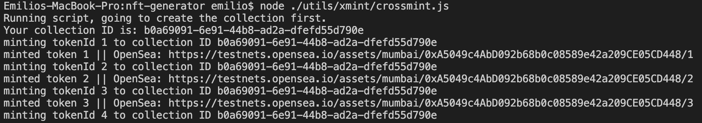

# CrossmintMinter
##### Specially crafted for [CrossMint][crossmint] 

## Tech Stack
- NodeJS
- Crossmint Minting API
- Cloudinary API
- OpenseaJS
- Hashlips for metadata and image generation?...

## Funtionality
The whole point of this standalone script is to aid new developers in minting projects with ease using crossmint. Developers usually start on HashLips for metadata and image generation. After this it is costly contracts, solidity programming and hosting your data.... There are many headaches and speedbumps along the way but this script can make it super easy to get the job done.

## Issues!!!!
I started coding this without realizing.... OpenSeaJS does **NOT** support mumbai. Only ETH mainnet and testnet (which is not currently supported publically by crossmint API). So, I left the shell of what **would** work and stripped it down to only minting with no listing. Hopefully someone can use this in the future!

## Flow
1. Generate metadata and images using [Hashlips][hashlips]
2. Once this is done, edit the configuration information on `crossmintMinter.js`
3. run the script using the command `node crossmintMinter.js`
4. Sit back and watch all your NFT's mint to your wallet.

## Configuration
I did not invoke environment variabled, it is highly suggested you use them though. Use `npm i` to install dependancies and then:

- Create a Crossmint API Key
- Create a Cloudinary API Key
- Note the location of your HashLips metadata

(future support for ETH requires an Infura API key, Mneumonic phrase as well as an OpenSea API key)

## How do we run this thing?
`node crossmintMinter.js` on the command line

## Looking forward
How can we improve this bot?
[ ] - Enable sending to different networks, for now I used mumbai only.
[ ] - Enable sending to email, for now I only used eth address
(the two design desicions above were done to work with OpenSea lister, but this did not pan out...)
[ ] - Enable different recipients per NFT

## UI? I guess it would be this:

I stopped the script at 5 of 10,000 NFTs for crossmints sake....
Please disregard the metadata/images, it is for a different project...
Here is the collection: [Collection on OpenSea][collection]

[crossmint]: <https://crossmint.io>
[collection]: <https://testnets.opensea.io/collection/nft-collection-rpjcwmmwkp>
[hashlips]: <https://github.com/HashLips/hashlips_art_engine>

#### Made by ether0 via Public Hackathon
